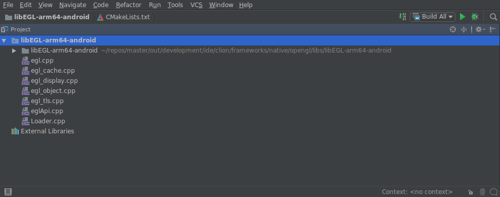
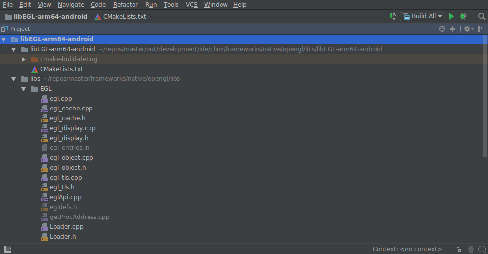

# CLion project generator

Soong can generate CLion projects. This is intended for source code editing
only. Build should still be done via make/m/mm(a)/mmm(a).

CMakeLists.txt project file generation is enabled via environment variable:

```bash
$ export SOONG_GEN_CMAKEFILES=1
$ export SOONG_GEN_CMAKEFILES_DEBUG=1
```

You can then trigger a full build:

```bash
$ make -j64
```
or build only the project you are interested in:

```bash
$ make frameworks/native/service/libs/ui
```

Projects are generated in the ``out`` directory. In the case of libui, the path would
be:

```bash
out/development/ide/clion/frameworks/native/libs/ui/libui-arm64-android/CMakeLists.txt
```
Note: The generator creates one folder per targetname-architecture-os combination.
In the case of libui you endup with two projects:

```bash
$ ls out/development/ide/clion/frameworks/native/libs/ui
libui-arm64-android libui-arm-android
```

### Edit multiple projects at once
To combine several projects into one, you can create super projects
and place them in:

```bash
development/ide/clion/[PATH_YOU_WANT]/..
```

These file will be symbolicaly linked in ``out/development/ide/clion``. All folders
will also be created there.

An example of a super project for surfaceflinger (using libui and libgui)
located in development/ide/clion/frameworks/native:

```
cmake_minimum_required(VERSION 3.6)
project(native)
add_subdirectory(services/surfaceflinger)
add_subdirectory(libs/ui/libui-arm64-android)
add_subdirectory(libs/gui/libgui-arm64-android)
```


### Flattened filesystem

Upon opening a project it looks like all the folder structure has been
flattened:



This is because you need to change the project root. Via Tools > CMake >
Change Project Root:



