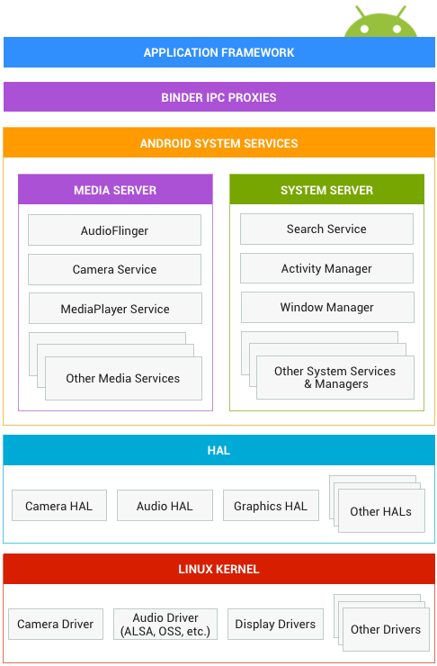

# Basics

[TOC]

## Overview

Before understanding how testing is done on [Android platform](http://source.android.com/devices/index.html),
please refer to the Android platform architecture for an overview.
The diagram from that page is embedded below for convenience:



## What to Test and How to Test

A platform test typically interacts with one or more of the Android system
services, or HAL layers, exercises the functionalities of the subject under test
and assert correctness of the testing outcome.

As such, a platform test may:

1.  exercise framework APIs via application framework; specific APIs being
    exercised may include:
    *   public APIs intended for 3rd party applications
    *   hidden APIs intended for privileged applications, aka system APIs
    *   private APIs (@hide, or protected, package private)
1.  invoke Android system services via raw binder/IPC proxies directly
1.  interact directly with HALs via low level APIs or IPC interfaces

Type 1 and 2 above are typically written as **instrumentation tests**, while
type 3 is typically written as **native tests** using gtest framework.

## Instrumentation Tests for Platform Testing

You may have read the [Testing Fundamentals](https://developer.android.com/tools/testing/testing_android.html)
on `developer.android.com`, however, there still may be some differences in
how instrumentation tests are used in platform testing.

In a nutshell, an instrumentation test provides a special test execution
environment as launched via `am instrument` command, where the targeted
application process is restarted and initialized with basic application context,
and an instrumentation thread is started inside the application process VM. Your
test code starts execution on this instrumentation thread, and is provided with
an `Instrumentation` instance which provides access to the application context
and APIs to manipulate the application process under test.

Some key concepts about instrumentation:

*   an instrumentation must be declared in an application package, with an
    [`<instrumentation>`](https://developer.android.com/guide/topics/manifest/instrumentation-element.html)
    tag nested under the `<manifest>` tag of the application package manifest
*   an application package manifest may technically contain multiple
    `<instrumentation>` tags, though it's not commonly used in this fashion
*   each `<instrumentation>` must contain:
    *   an `android:name` attribute: it should be the name of a subclass of
        [`Instrumentation`](https://developer.android.com/reference/android/app/Instrumentation.html)
        that's included in the test application, which is typically the test
        runner that's being used, e.g.
        `android.support.test.runner.AndroidJUnitRunner`
    *   an `android:targetPackage` attribute must be defined. Its value should
        be set to the application package under test

In the context of platform testing, there are typically two categories of
instrumentation tests:

### Instrumentation tests targeting application packages included in system

This category of instrumentation test isn't that different from those targeting
the regular Android applications. It's worth noting that the test application
that included the instrumentation needs to be signed with the same certificate
as the application that it's targeting.

To learn more, see our [end-to-end example](../development/instr-app-e2e.md).

### Instrumentation tests targeting itself

As mentioned earlier, when an instrumentation is started, its target package is
restarted with instrumentation code injected and initiated for execution. One
exception is that the target package here cannot be the Android application
framework itself, i.e. the package `android`, because doing so would lead to the
paradoxical situation where Android framework would need to be restarted, which
is what supports the system functions, including the instrumentation itself.

This means that an instrumentation test cannot inject itself into Android
framework, a.k.a. the system server, for execution. In order to test Android
framework, the test code can only invoke public API surfaces, or those exposed
via [AIDL](https://developer.android.com/guide/components/aidl.html)s available
in platform source tree. For this category of tests, it's not meaningful to
target any particular package, therefore it's customary for such
instrumentations to be declared to target its own test application package, as
defined in its own `<manifest>` tag of `AndroidManifest.xml`.

Depending on the requirements, test application packages in this category may
also:

*   Bundle activities needed for testing.
*   Share the user ID with the system.
*   Be signed with the platform key.
*   Be compiled against the framework source rather than the public SDK.

This category of instrumentation tests are sometimes refered to as
self-instrumentations. Below are some examples of such instrumentation tests in
platform source:

```
frameworks/base/core/tests/coretests
frameworks/base/services/tests/servicestests
```

To learn more, see our [end-to-end example](../development/instr-self-e2e.md).

## Native Tests for Platform Testing

A native test for platform testing typically accesses lower level HALs, or
performs raw IPC against various system services, therefore the testing approach
is typically tightly coupled with the service under test, outside the scope of
this documentation.

Building native tests using [gtest](https://github.com/google/googletest)
framework is strongly recommended, and a prerequisite for integration with
continuous testing infrastructure.

Below are some examples of such native tests in platform source:

```
frameworks/av/camera/tests
frameworks/native/libs/gui/tests
```

To learn more, see our [end-to-end example](../development/native-func-e2e.md).

## Compatibility Test Suite (CTS)

[Android Compatibility Test Suite](https://source.android.com/compatibility/cts/)
is a suite of various types of tests, used to ensure compatibility of
Android framework implementations across OEM partners, and across platform
releases. **The suite also includes instrumentation tests and native tests
(also using gtest framework).**

CTS and platform tests are not mutually exclusive, and here are some general
guidelines:

*   if a test is asserting correctness of framework API functions/behaviors, and
    it should be enforced across OEM partners, it should be in CTS
*   if a test is intended to catch regressions during platform development
    cycle, and may require privileged permission to carry out, and may be
    dependent on implementation details (as released in AOSP), it should only be
    platform tests
